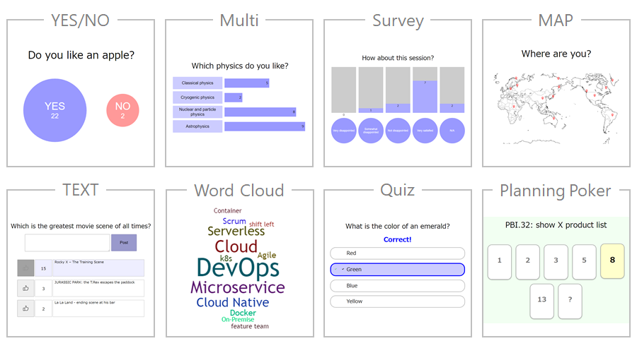

## volavote

### Connect remotely via poll

It's more difficult to pick up on the atmosphere of a telecon session than an offline's one.
volavote can help you to know remote attendees to easily make various type of poll.

### Various type of poll you can make

You can make a poll from a simple Yes/No style poll to a planning poker.
Some of poll can be used as an ice-break and other can correct feedback and understand what they think.

### Easy to deploy

You can deploy this application using <a href="https://hub.docker.com/r/shyamagu/volavote" target="_blank">Dokcer image</a> wherever you want.
or you can clone source code from <a href="https://github.com/shyamagu/volavote2" target="_blank">GitHub repository</a> and deploy whereever you want.

### How to use

If you are an admin, please use environment variables that ADMIN_NAME is admin username and ADMIN_PASSWORD is admin password (default setting is vvadmin/vvpassword).
If you are a volavote parent user, ask your admin about your login name/password and login at parent login portal.
If you are just a user of volavote, please ask your admin or parent user about poll page url or how to use.

